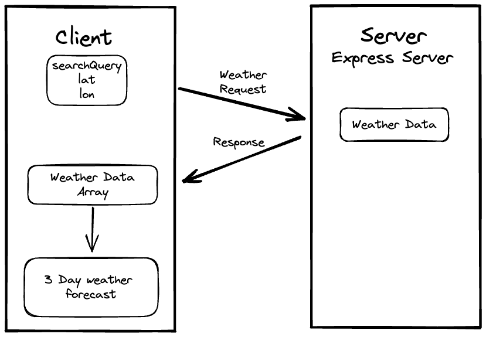

# City Explorer Server

**Author**: Julian Barker
**Version**: 1.0.0 (increment the patch/fix version number if you make more commits past your first submission)

## Overview

This application creates a server with endpoints from which a client can request information (in this case, weather info)

## Getting Started

1. create github repo with MIT license
2. clone from gh to local machine
3. add `.gitignore` and `.eslintrc.json`
4. add `.env` with PORT value for localhost listening
5. use npm init to create `package.json`
6. use `npm i express dotenv cors` to create dependencies
7. use `npm i -g nodemon` for easily running the server
8. add `server.js` and require `'express'`, `'dotenv'`, and `'cors'`
9. use `cors()` as middleware with `app.use()`
10. Declare PORT variables
11. Listen for connections with `app.listen()`
12. Declare endpoints with `app.get()/.post()/.put()/.patch()`

<!-- What are the steps that a user must take in order to build this app on their own machine and get it running? -->

## Architecture

We use express.js cors, dotenv, nodemon, and javascript and the json format.

<!-- Provide a detailed description of the application design. What technologies (languages, libraries, etc) you're using, and any other relevant design information. -->

## Change Log

09-27-2022 1551 - Application now handles requests for forecast data based on the query (city) and returns the appropriate data. Application handles invalid requests.

## Credit and Collaborations

Worked with Jose Gonzales on the WRRC diagram and reviewed code with him.

Received help from Mehtab Riar on using thunder client

## Time Estimates

### Handle Requests for Weather

Estimate of time needed to complete: 2hr

Start time: 1300

Finish time: 1500

Actual time needed to complete: 2 hr